# 启明2机器人开放源码

## 使用步骤

1. 安装ROS(Noetic/Ubuntu 20.04). [安装步骤](http://wiki.ros.org/noetic/Installation/Ubuntu?_blank)
2. 配置好开发环境. [配置方法](http://wiki.ros.org/ROS/Tutorials/InstallingandConfiguringROSEnvironment)
3. 获取源码:
```
cd ~/catkin_ws/src/
git clone https://github.com/6-robot/wpr2.git
git clone https://github.com/6-robot/waterplus_map_tools.git
```
4. 安装依赖项
```
cd ~/catkin_ws/src/wpr2_bringup/scripts
./install_deps.sh
./orbbec_femto_bolt_ros1_install.sh
./create_udev_rules.sh 
```
5. 编译
```
cd ~/catkin_ws
catkin_make
```
6. 欢迎享用 :)

## 平台介绍
启明2是[北京六部工坊科技有限公司](http://www.6-robot.com)推出的一款面向仿人操作应用的教学竞赛科研平台。整机采用模块化设计，由麦克纳姆轮全向底盘、可升降的动力脊柱、两只高精度机械臂、新一代的立体视觉系统和语音交互系统组成。结合传统的CNN卷积神经网络，Conformer语音识别模型，加上前沿的VLA视觉动作模型。启明2双臂机器人可以完成人脸识别、肢体识别、语音指令识别以及自主导航和物品取放操作。是具身智能研究以及各类服务机器人比赛的绝佳载体。得益于模块化的结构设计，启明2双臂机器人具备极高的硬件扩展性，可以很方便的集成和替换各种新式传感器和执行器。使得启明2双臂机器人在未来很长的一段时间里，可以最大限度的适应具身智能的高速发展。
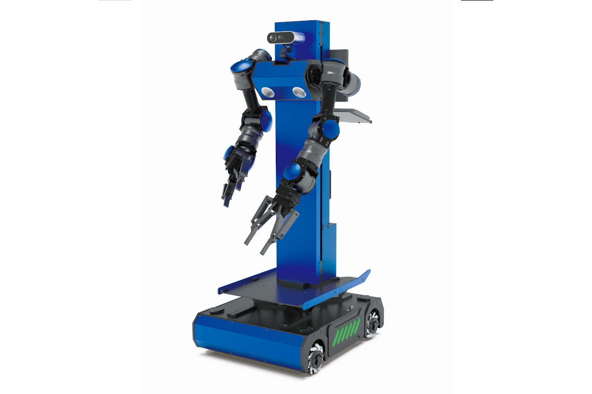

## 硬件特点

### 1. 仿人机械臂
启明2机器人搭载了两条六自由度仿人机械手臂，手臂的末端是一个两指机械手爪。机械手臂的关节设置参考了人类手臂，可以很直观的对人类动作数据进行迁移学习。
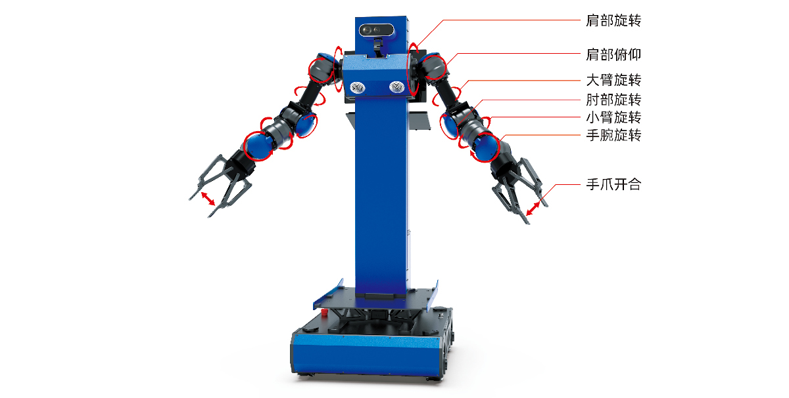

### 2. 升降机构
启明2机器人的背部设计了一个升降机构，机器人的上半身（包括机械臂和头部）可以在竖直方向上主动移动，为识别和抓取不同高度的物体提供了便利。
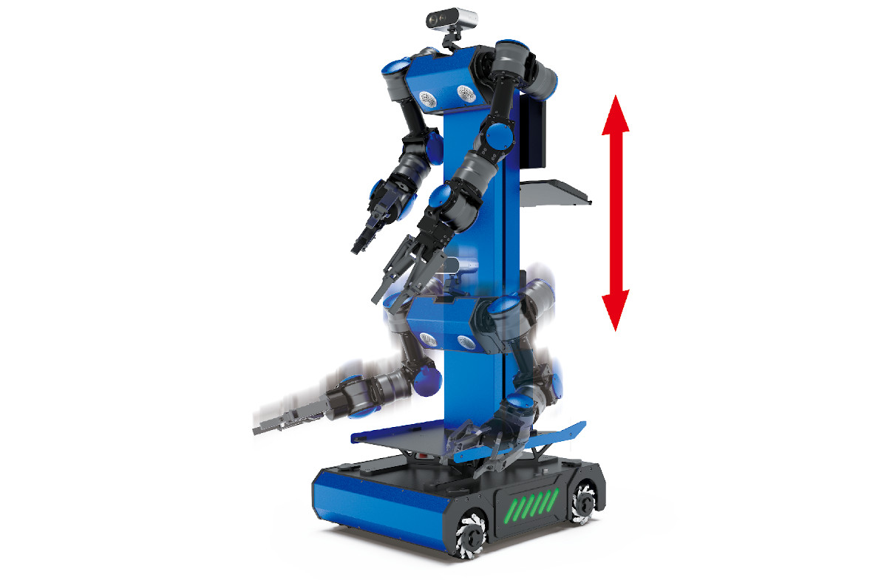

### 3. 底盘结构
启明2机器人采用了四轮全向式移动底盘，可以在不改变朝向的情况下沿任意方向移动，在运动过程中可以高效的进行位姿调整。同时每个电机模组都配备了独立悬挂，保证了运动的平稳性。
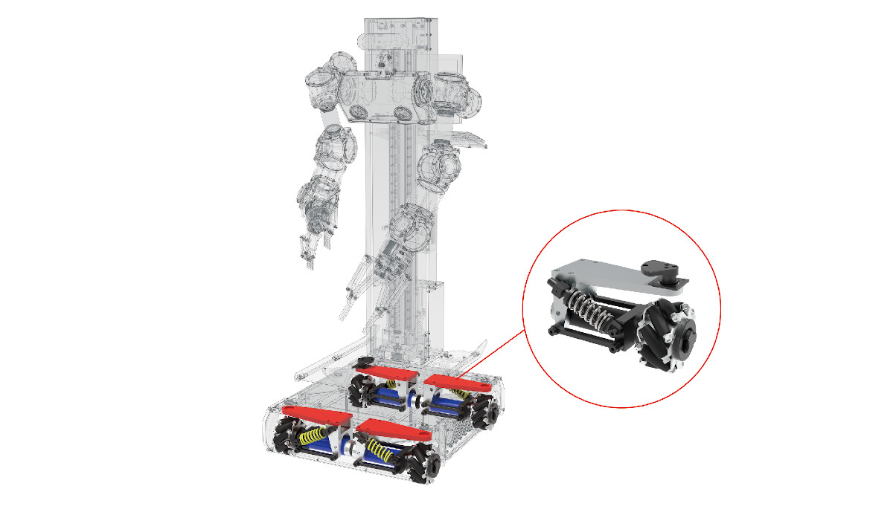

### 4. 模块化设计
启明2机器人采用整体模块化设计，可实现快速拆装，方便进行收纳和运输。另外各个组件模块可以随意替换，具有很强的功能扩展性。
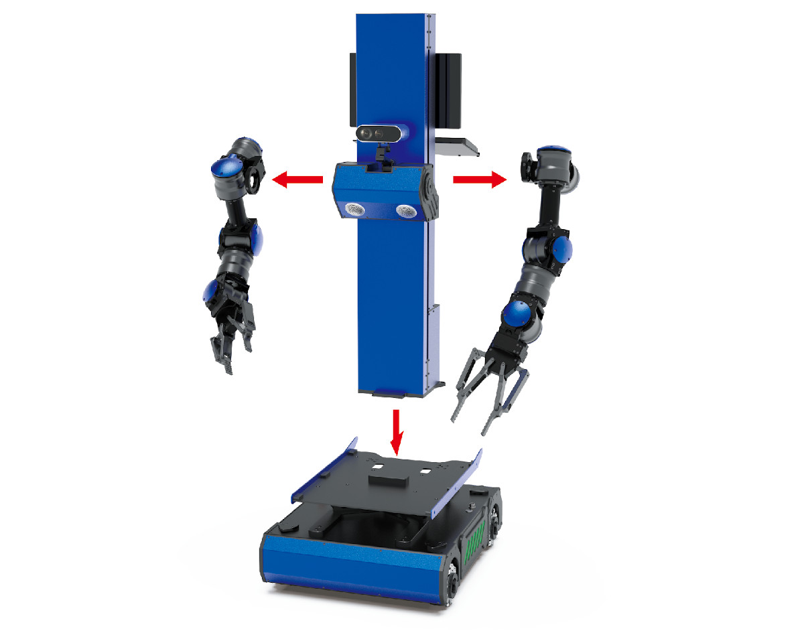

## 功能概览

### 1. URDF模型描述
启明2运行ROS操作系统，具备完整的URDF模型描述，可以在ROS系统里直接加载。
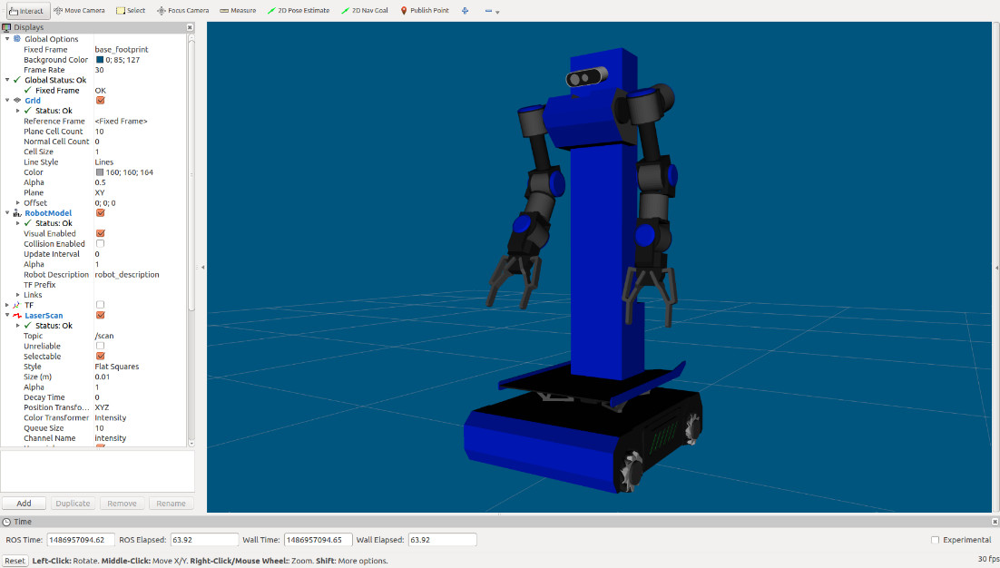

### 2. 电机码盘里程计
启明2装备了带编码器的直流伺服电机，可以在ROS里接收电机码盘计数，从而推算出机器人的移动里程信息。
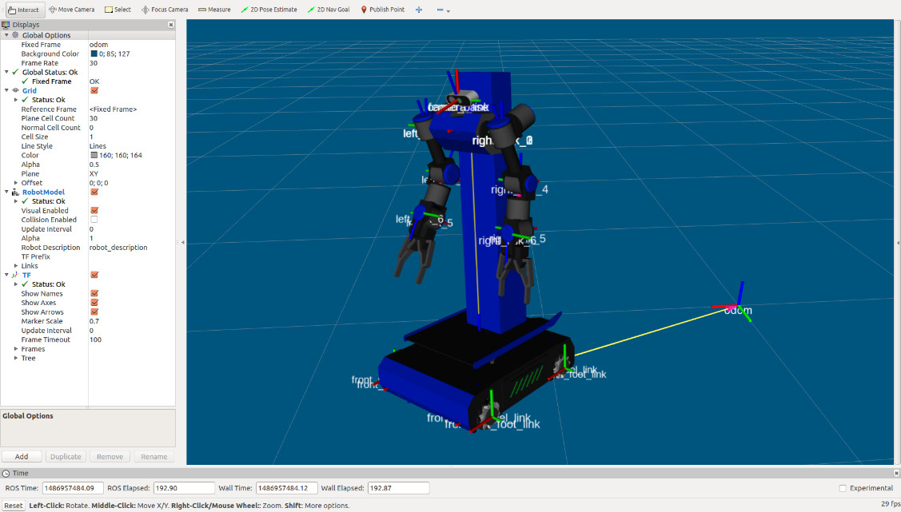

### 3. IMU姿态传感
启明2内置了一枚六轴的IMU单元，可以实时获取机器人的姿态信息，为机器人的上层控制算法提供数值依据。
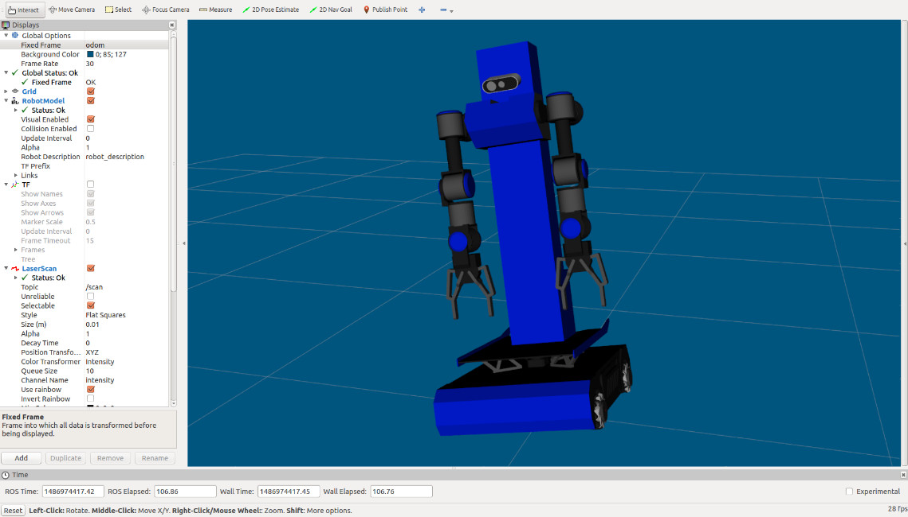

### 4. 三维立体视觉
启明2采用最新一代的TOF立体相机，探测距离达到8米，最大视角70°，可以有效获取视野内的环境物体的三维信息。
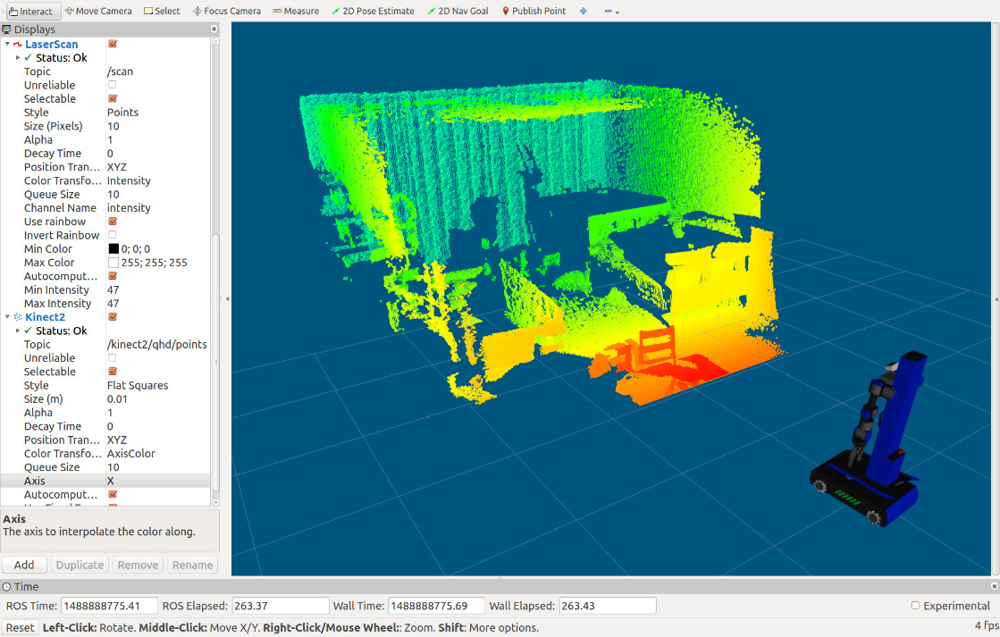

### 5. 运动学解算
启明2机器人的仿人机械臂全面接入ROS的MoveIt!系统，可以实现基于手爪末端姿态的运动学解算。
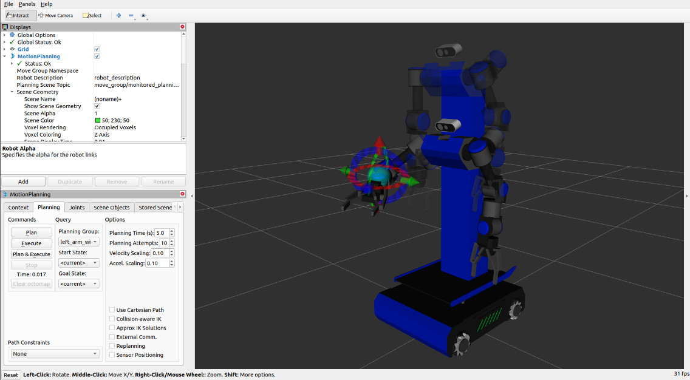

### 6. 卷积神经网络
启明2机器人使用后训练的卷积神经网络对物体进行识别，并在RGB平面图像中定位目标物体。
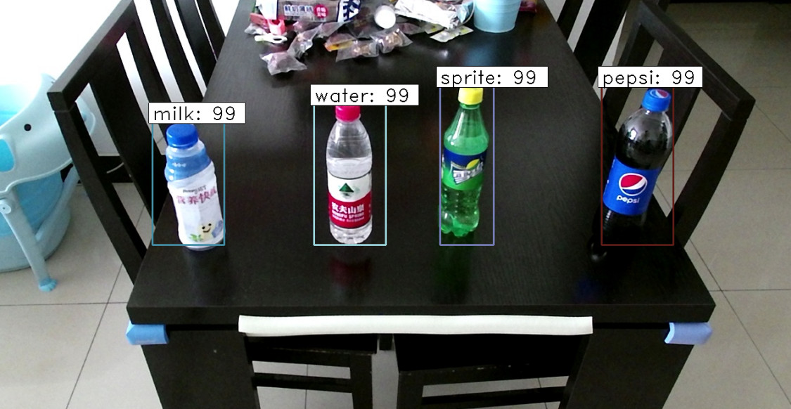

### 7. 物品识别和抓取
启明2机器人通过立体相机获得彩色图像和三维点云，对视野中的物品进行识别和定位，进而控制机械臂进行目标物品的抓取动作。
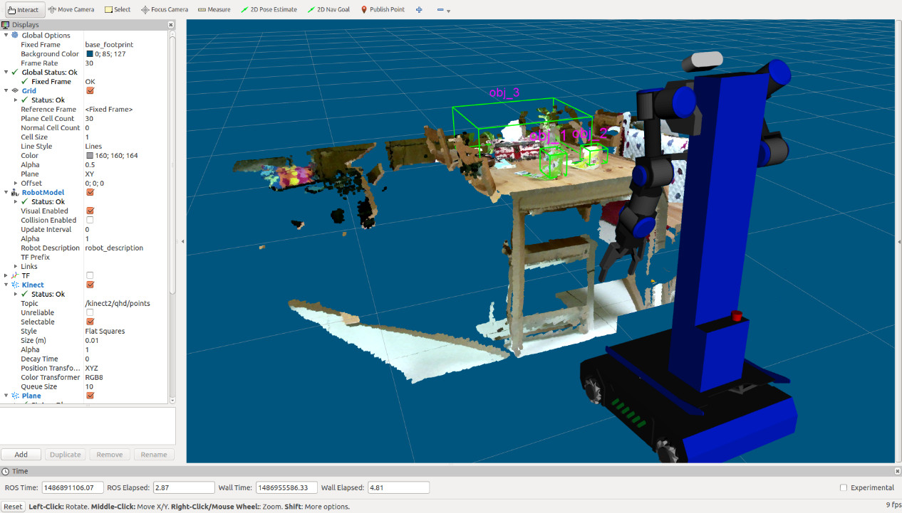

### 8. 人脸识别
启明2机器人头部的高分辨率摄像机，对环境中的人脸特征进行检测识别。并根据立体相机采集的点云，计算其三维空间坐标。
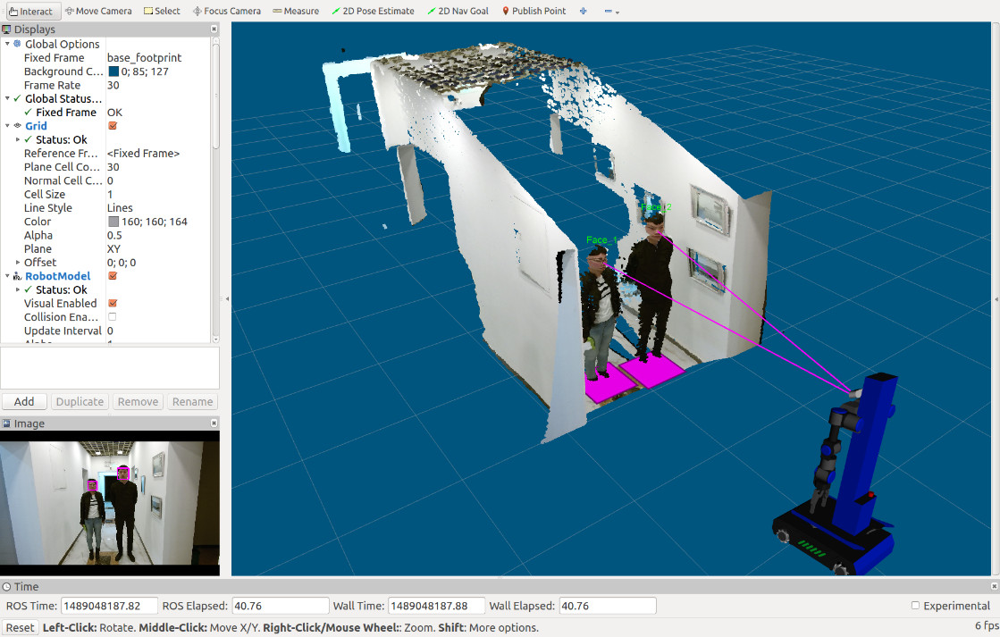

### 9. 动态目标跟随
启明2机器人可以快速锁定一个跟踪目标，保持指定距离，一直尾随目标物进行移动。
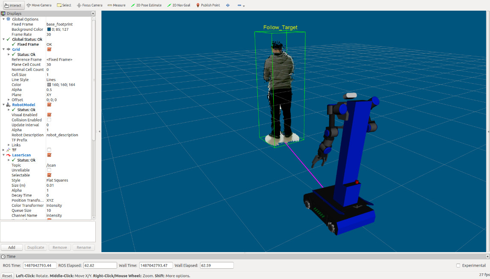

### 10. SLAM环境建图
启明2机器人装备高精度激光雷达，可以实时扫描机器人周围的障碍物分布状况。结合多种SLAM算法，可创建环境地图。
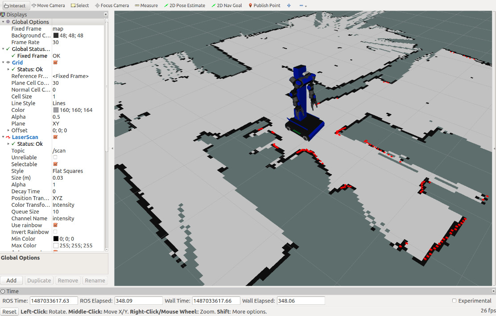

### 11. 自主定位导航
明2机器人将激光雷达扫描的距离信息与电机里程计数据进行融合，使用AMCL方法进行地图定位，结合ROS里的move_base / NAV2进行自主导航。
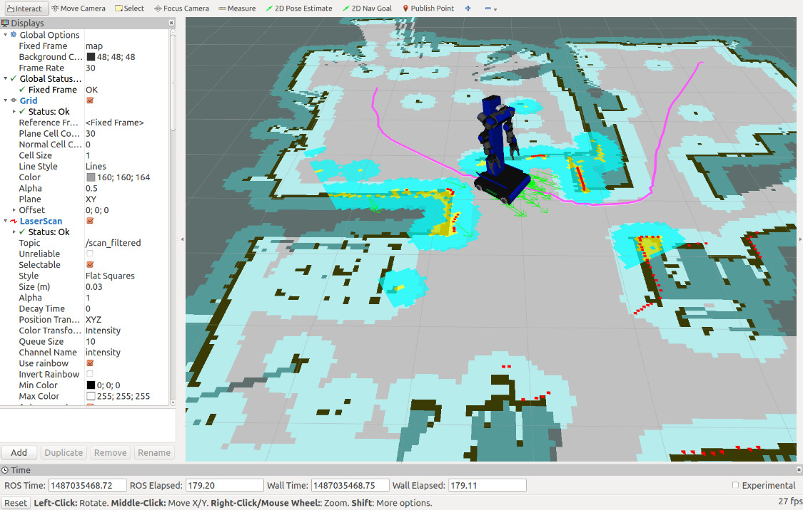

### 12. 仿真系统
启明2机器人配备了完整的物理惯量和传感器参数描述，可以在GAZEBO仿真环境里直接加载。附赠的源码资源中，包含多个物理仿真场景，可以脱离机器人实体，在纯软件环境中先进行算法模拟。
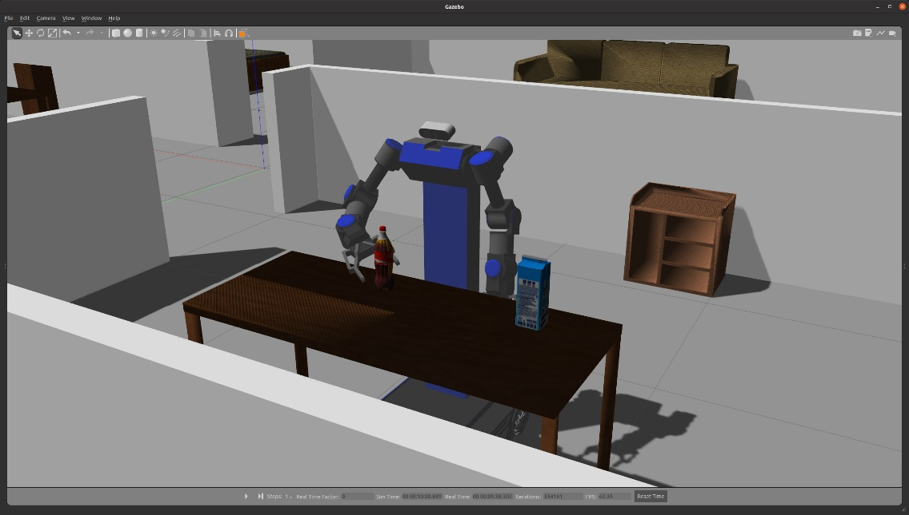


